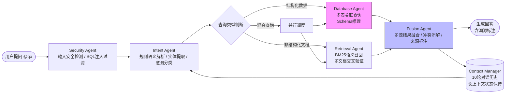

# Enterprise QA Agent Suite

基于多智能体协同的企业知识推理引擎，支持长链推理、多源数据融合与复杂业务查询。

## Overview

本系统采用分层Agent架构，面向企业内部高频知识查询场景。通过多个垂直Agent协作，解决传统企业问答系统"只能查单一数据源"、"无法理解跨系统关联问题"、"缺乏安全与溯源能力"三大痛点。

## Architecture



## Core Agents

### Security Agent
- SQL注入防护、终端命令拦截
- 敏感数据访问权限校验
- 输入合规性审查

### Intent Agent
- 基于关键词规则的语义解析与实体提取
- 查询意图分类：DB_ONLY / KB_ONLY / HYBRID / AMBIGUOUS
- 上下文继承（支持连续追问）

### Database Agent
- **多表关联查询链路**：实体提取 → Schema匹配 → SQL生成 → 执行 → 结果格式化
- 单次复杂查询涉及 employees / projects / attendance / performance_reviews 四表关联
- 支持跨表关联查询（如"王五符合晋升条件吗"需同时查绩效表+项目表+晋升制度）

### Retrieval Agent
- BM25 + 邻居块上下文召回
- 多文档交叉验证与去重
- 支持Markdown制度文档、会议纪要等非结构化数据

### Fusion Agent
- 多源信息冲突消解（如数据库考勤记录 vs 制度文档解释）
- 自动标注数据来源（`来源：Employees 表` / `来源：hr_policies.md §3.2`）
- 晋升条件自动匹配与结论判定

### Context Manager
- 维护最近10轮对话状态
- 长上下文窗口管理
- 多轮链路的中间状态保持

## Key Scenarios

| 场景 | 涉及Agent | Token消耗特征 |
|------|----------|--------------|
| 单点查询（如"王五是谁"） | Security → Intent → Database | ~2k Token |
| 制度咨询（如"年假怎么算"） | Security → Intent → Retrieval | ~4k Token |
| **混合推理（如"王五符合晋升条件吗"）** | **Intent → Database + Retrieval → Fusion** | **~15k Token，含多表Schema推理** |
| 连续追问（上下文继承） | Context Manager → Intent → ... | 逐轮累积 |

## Installation

OpenClaw Skill 标准安装：

```bash
# 方式一：extensions目录（开发环境）
cp -r enterprise-qa extensions/enterprise-qa.skill

# 方式二：全局skills目录（生产环境）
cp -r enterprise-qa ~/.openclaw/skills/enterprise-qa.skill/
```

```bash
cd enterprise-qa/scripts
pip install -r requirements.txt  # Python 3.10+
```

验证：
```
@qa 王五是谁？
```

## Configuration

编辑 `scripts/config.yaml`：

```yaml
database:
  path: ./enterprise.db

knowledge_base:
  root_path: ./knowledge
```

## Project Structure

```
enterprise-qa/
├── SKILL.md                  # OpenClaw Agent操作说明书
├── README.md                 # 本文档
├── scripts/
│   ├── qa_ask.py            # 入口调度脚本
│   ├── config.yaml          # 数据源配置
│   ├── enterprise.db        # 结构化数据(SQLite)
│   ├── qa_history.json      # 对话上下文状态
│   ├── enterprise_qa/       # Agent引擎核心代码
│   │   ├── safety.py        # Security Agent
│   │   ├── intent.py        # Intent Agent
│   │   ├── db_engine.py     # Database Agent
│   │   ├── kb_engine.py     # Retrieval Agent
│   │   ├── orchestrator.py  # Orchestrator + Fusion Agent
│   │   └── config.py        # 配置加载
│   ├── knowledge/           # 非结构化知识库
│   └── tests/               # 单元测试
└── references/
    ├── architecture.md      # 架构设计文档
    └── test-cases.md        # 测试用例与验收标准
```

## Testing

```bash
cd scripts
python -m pytest tests/ -v
```

## Changelog

- `v0.2.0` — 多Agent并行调度与长上下文融合查询
- `v0.1.0` — Core QA Agent引擎，支持NL→SQL与BM25检索

## License

MIT
