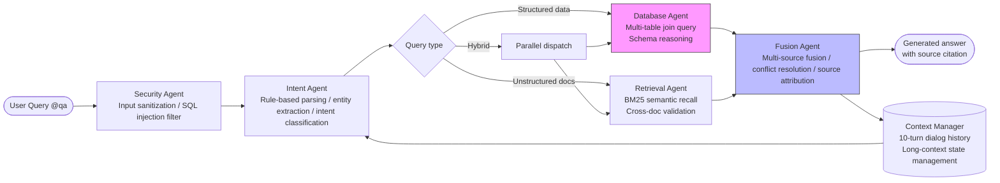

# Enterprise QA Agent Suite

A multi-agent collaborative enterprise knowledge reasoning engine supporting long-chain reasoning, multi-source data fusion, and complex business queries.

## Overview

This system employs a layered Agent architecture for high-frequency enterprise knowledge query scenarios. Through collaboration of multiple vertical Agents, it solves three pain points of traditional enterprise QA systems: "single data source limitation", "inability to understand cross-system correlation queries", and "lack of security and traceability".

## Architecture



## Core Agents

### Security Agent
- SQL injection prevention, command injection blocking
- Sensitive data access permission validation
- Input compliance check

### Intent Agent
- Rule-based semantic parsing and entity extraction
- Intent classification: DB_ONLY / KB_ONLY / HYBRID / AMBIGUOUS
- Context inheritance (supports follow-up questions)

### Database Agent
- **Multi-table join query chain**: entity extraction → schema matching → SQL generation → execution → result formatting
- Complex queries span employees / projects / attendance / performance_reviews (4 tables)
- Supports cross-table correlation queries (e.g., "Is Wang Wu eligible for promotion?" requires checking performance + projects + policies)

### Retrieval Agent
- BM25 + neighbor context recall
- Cross-document validation and deduplication
- Supports Markdown policy documents, meeting notes, and other unstructured data

### Fusion Agent
- Multi-source conflict resolution (e.g., attendance records vs. policy interpretation)
- Automatic source citation (`Source: Employees table` / `Source: hr_policies.md §3.2`)
- Promotion condition auto-matching and verdict generation

### Context Manager
- Maintains last 10 turns of dialog state
- Long-context window management
- Intermediate state persistence for multi-turn reasoning chains

## Key Scenarios

| Scenario | Agents Involved | Token Consumption |
|----------|----------------|-------------------|
| Simple query (e.g., "Who is Wang Wu") | Security → Intent → Database | ~2k Token |
| Policy inquiry (e.g., "How does annual leave work?") | Security → Intent → Retrieval | ~4k Token |
| **Hybrid reasoning (e.g., "Is Wang Wu eligible for promotion?")** | **Intent → Database + Retrieval → Fusion** | **~15k Token, multi-table schema reasoning** |
| Follow-up questions (context inheritance) | Context Manager → Intent → ... | Cumulative per turn |

## Installation

OpenClaw Skill standard installation:

```bash
# Option 1: extensions directory (development)
cp -r enterprise-qa extensions/enterprise-qa.skill

# Option 2: global skills directory (production)
cp -r enterprise-qa ~/.openclaw/skills/enterprise-qa.skill/
```

```bash
cd enterprise-qa/scripts
pip install -r requirements.txt  # Python 3.10+
```

Verify:
```
@qa Who is Wang Wu?
```

## Configuration

Edit `scripts/config.yaml`:

```yaml
database:
  path: ./enterprise.db

knowledge_base:
  root_path: ./knowledge
```

## Project Structure

```
enterprise-qa/
├── SKILL.md                  # OpenClaw Agent operation manual
├── README.md                 # This document
├── scripts/
│   ├── qa_ask.py            # Entry point script
│   ├── config.yaml          # Data source config
│   ├── enterprise.db        # Structured data (SQLite)
│   ├── qa_history.json      # Dialog context state
│   ├── enterprise_qa/       # Agent engine core
│   │   ├── safety.py        # Security Agent
│   │   ├── intent.py        # Intent Agent
│   │   ├── db_engine.py     # Database Agent
│   │   ├── kb_engine.py     # Retrieval Agent
│   │   ├── orchestrator.py  # Orchestrator + Fusion Agent
│   │   └── config.py        # Configuration loader
│   ├── knowledge/           # Unstructured knowledge base
│   └── tests/               # Unit tests
└── references/
    ├── architecture.md      # Architecture design doc
    └── test-cases.md        # Test cases and acceptance criteria
```

## Testing

```bash
cd scripts
python -m pytest tests/ -v
```

## Changelog

- `v0.2.0` — Multi-Agent parallel dispatch and long-context fusion queries
- `v0.1.0` — Core QA Agent engine with NL→SQL and BM25 retrieval

## License

MIT
